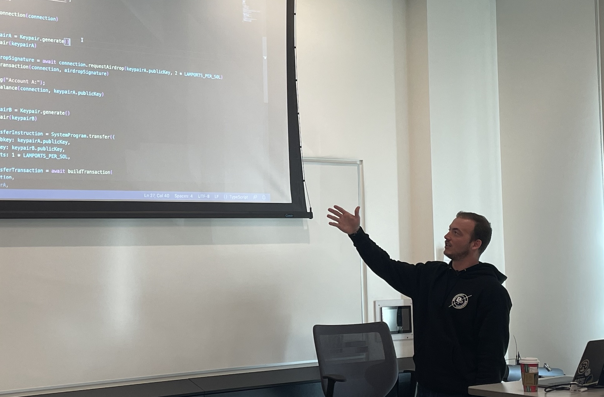
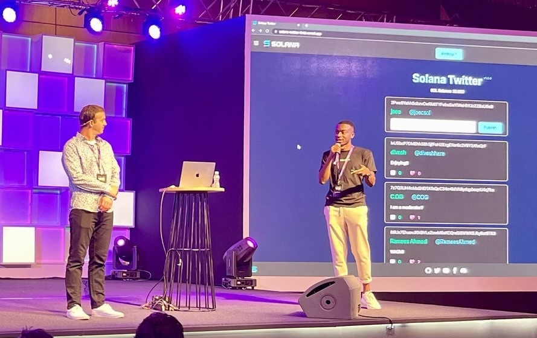
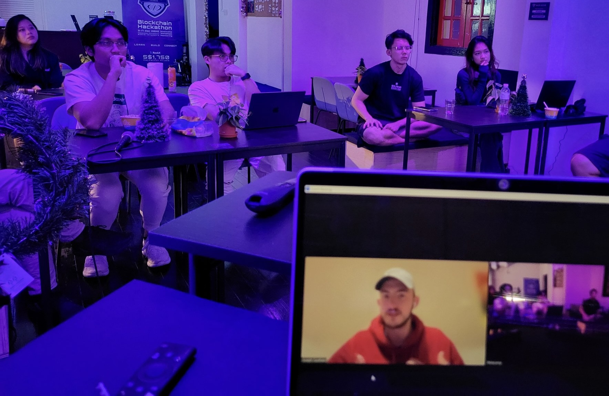

# Solana Workshops

🧑‍🚀 Hello fren, have you attended any of these workshops?   

 
 
 
 

---

### 🚧 This repository is currently under construction 🚧

Please see [CONTRIBUTING](./CONTRIBUTING.md) for instructions on contributing new workshops or modifying existing ones.

---

| Workshop | Description | Author |
| -------- | ----------- | ------ |
| Getting Started with Solana 101 | A non-technical presentation on Solana basics. | Colin Ogoo |
| Solana for Beginners Crash Course | A crash course for beginners. Covers basics such as transactions, accounts, tokens, and a HelloWorld smart contract (program). | Joe Caulfield |
| Deep Dive into Writing Solana Programs | An extensive look at writing Solana Programs in Rust, with a preview of different frameworks like Anchor and Seahorse. | Joe Caulfield |
| NFT Minter | A simple web page for uploading an image and minting it into an NFT. | Joe Caulfield |
| SVG Generator | Rendering an SVG image from randomized strings stored in a Solana on-chain account. | Courtney Jensen & Joe Caulfield |
| Solana Journal | A simple journal entry dApp writing entries to the Solana blockchain. | Joe Caulfield |
| Solana Twitter | A mock Twitter social media site built on top of on-chain data. | Joe Caulfield |
| Battle Royale | A fun little game leveraging on-chain data. | Joe Caulfield |
| Building a Storefront with Solana Pay | A storefront dApp capable of taking payments of SPL tokens using the Solana Pay SDK and Transaction Requests | Joe Caulfield |
| Ship Your First xNFT | Building an xNFT and deploying it to Backpack | Valentin Madrid |
